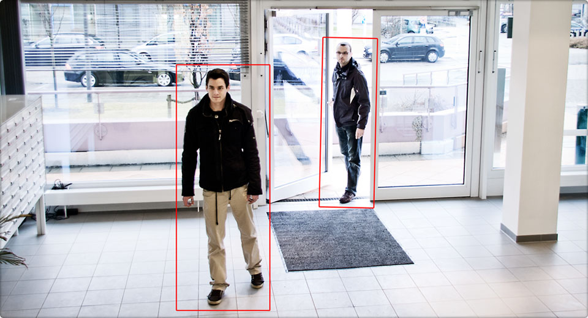

# Opencv-kh Framework
This is a Computer Vision demo framework that makes the people who want to learn opencv more eaiser to begin with many fun functions for image processing and AI. Its core is build many things like opencv,mediapipe,Face Detection ...

> Download the source code and it you can use the classes within Framework folder

> This project is build for educational purposes only that why it not a  python packages
---

## Face Detection Methods
---

```python
import cv2
from Framework.FaceDet import FaceDetection

cap = cv2.VideoCapture(0)

while True:
    ret,img = cap.read()

    Faceimage = FaceDetection(img)

    # Choose one of these face detection methods

    # Faceimage.haar() # Viola-jones
    # Faceimage.deep_learn() # Deep learning
    # Faceimage.hog() # Dlib face Detection


    cv2.imshow("Face",img)
    k = cv2.wait(1) &0xFF
    if k == ord('q'):
        break

cap.release()
cv2.destroyAllWindows()
```
---
## MediaPipe Features Detections
---

```python
import cv2
from Framework.Mediapipe import Media

cap = cv2.VideoCapture(0)

# Mediapipe objects Choose which feature you want to test
mpDraw = Media.media_draw() 
faceDetection = Media.face_solution()
facemesh = Media.mesh_solution()
handdetection,mphand = Media.hand_solution()
mppose,pose = Media.pose_solution()

while True:
    ret,img = cap.read()
    MediaImage = Media(img)


    # Choose which feature to run 
    # MediaImage.media_face(faceDetection)
    # MediaImage.media_mesh(facemesh)
    # MediaImage.media_hand(handdetection,mphand)
    # MediaImage.media_pose(pose,mppose)


    cv2.imshow("Face",img)
    k = cv2.wait(1) &0xFF
    if k == ord('q'):
        break

cap.release()
cv2.destroyAllWindows()
```
---
## Features Detection
---

```python
import cv2
from Framework.FeatureDet import Features

cap = cv2.VideoCapture(0)

while True:
    ret,img = cap.read()


    # Choose which feature to run motion detection or emotion detection
    # Features(img).motion_detection(cap)
    # Features(img).emotion_detection()

    cv2.imshow("Face",img)
    k = cv2.wait(1) &0xFF
    if k == ord('q'):
        break

cap.release()
cv2.destroyAllWindows()
```
---
## Tracking Systems
---

```python
import cv2
from Framework.TrackingObj import Track


cap = cv2.VideoCapture(0)

### Tracking API choose which api you want
# tracker = cv2.TrackerMIL_create()
# tracker = cv2.TrackerKCF_create()
# tracker = cv2.TrackerCSRT_create()
###Tracking
ok,bbox = Track.track_solution(cap,tracker)

while True:
    ret,img = cap.read()

    Track(img).track_detect(tracker,ok,bbox)

    cv2.imshow("Face",img)
    k = cv2.wait(1) &0xFF
    if k == ord('q'):
        break

cap.release()
cv2.destroyAllWindows()
```
---
## Image Processing Functions
---

> This Class have little some build in functions of opencv
```python
import cv2
from Framework.ImagePro import Image

cap = cv2.VideoCapture(0)


while True:
    ret,img = cap.read()
    image = Image(img)

    #Image processing##########
    #image.infinity_video(cap)#Restart the video again
    # gray = image.bgr_gray()
    # rgb = image.bgr_rgb()
    # blur = image.blur()
    # canny = image.canny()
    # res = image.resize(300,200)#width,height
    # image.draw_rectangle(10,20,30,40) #draw rectangle
    #image.put_text(int(fps),20,35)


    cv2.imshow("Face",img)
    k = cv2.wait(1) &0xFF
    if k == ord('q'):
        break

cap.release()
cv2.destroyAllWindows()
```
---
## Region of interset (ROI)
---
```python
import cv2
from Framework.ImagePro import Image

cap = cv2.VideoCapture(0)

list = Image.select_roi(cap)

while True:
    ret,img = cap.read()
    image = Image(img)


    roi_frame = image.draw_roi(list)


    cv2.imshow("Face",img)
    k = cv2.wait(1) &0xFF
    if k == ord('q'):
        break

cap.release()
cv2.destroyAllWindows()
```
> This is a very small functions of computer vision. This world is so big hope you have fun with this project and benefit from it as you much.